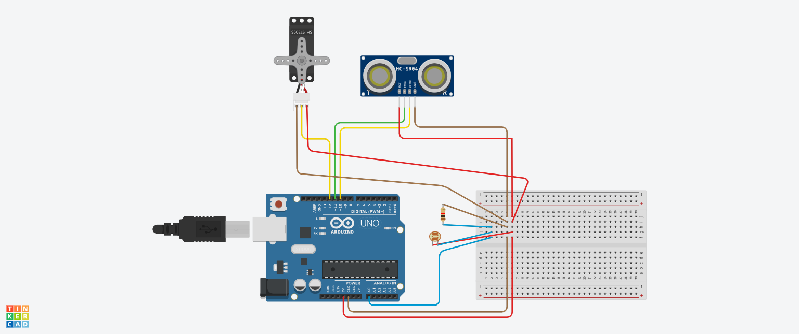

# Integrantes
- Gerald Andrés Espinoza Tapia
- Lucas Enrique Robles Chávez

# 1. Hacer el esquema de conexión en TinkerCard.

# 2. Responder las siguientes preguntas:

## a. Información del datasheet del sensor SR04 y de la fotoresistencia (LDR). Deberá consultar las propiedades del sensor algunas son: costo, velocidad de operación, tasa de error, robustez, peso, tamaño, etc.

- **Ultrasonido (HC-SR04):**
  - costo: $ $2$
  - velocidad de operación: $10 μs$
  - tasa de error: NO ENCONTRADO
  - robustez: NO ENCONTRADO 
  - peso: $10 g$
  - tamaño: $45$ mm x $20$ mm x $15$ mm

- **Fotoresistencia (LDR):**
  - costo: $ $20$
  - velocidad de operación: $60 ms$ de subida y $25 ms$ de bajada
  - tasa de error: No posee
  - robustez: Alta, puede operar en gran variedad de temperaturas y ambientes.
  - peso: Generalmente menos de $1 g$
  - tamaño: Generalmente de pocos centímetros a pocos milímetros

## b. Información del datasheet de Arduino UNO y consultar el tipo de microcontrolador, memoria, y número de puertos análogos y digitales.

- **Arduino UNO:**
  - microcontrolador: ATmega328P
  - memoria: SRAM de 2 KB, FLASH de 32 KB, EEPROM de 1 KB
  - puertos análogos: 6
  - puertos digitales: 14

## c. ¿Para qué sirve la resistencia en fija unida con la fotoresistencia?

Junto con el fotoresistor forman un divisor de voltaje. Para ajustar y controlar la respuesta del circuito electrónico a la luz ambiental. 

## d. ¿Cuál es la diferencia entre pull-down y pull-up?

La diferencia es cómo se conectan las resistencias en relación con el voltaje de referencia y la señal de entrada. La diferencia clave radica en si la resistencia se conecta a la fuente de voltaje positiva (pull-up) o a tierra (pull-down), determinando así el estado lógico predefinido del pin cuando no está activo.

# 3. Hacer el programa realizando el IDE de Arduino (Código). Debe instalar la librería Servo para poner a funcionar el actuador.
~~~
// C++ code
#include <Servo.h>

// SERVO
Servo servo1;
int PINSERVO = 12;
int PULSOMIN = 1000;
int PULSOMAX = 2000;

// ULTRASONIDO
int TRIG = 11;
int ECHO = 10;

//FOTORESISTOR
int PINLCD = A0;
int UMBRAL = 400;
int LCD;

void setup()
{
  Serial.begin(9600);
  // SERVO
  servo1.attach(PINSERVO, PULSOMIN, PULSOMAX);
  //ULTRASONIDO
  pinMode(TRIG, OUTPUT);
  pinMode(ECHO, INPUT);
  digitalWrite(TRIG, LOW);
}

void loop()
{ 
  // ULTRASONIDO
  long t = 0; // tiempo que demora en llegar el eco
  long d = 0; // distancia en centimetros
  
  digitalWrite(TRIG, HIGH);
  delayMicroseconds(1);
  digitalWrite(TRIG, LOW);
  
  t = pulseIn(ECHO, HIGH); // obtener ancho del pulso
  d = t/59; // escalamos el tiempo a una distancia en cm
  
  
  //FOTORESISTOR
  LCD = analogRead(PINLCD);
  
  Serial.println(LCD);
  // Serial.println(d);
  
  // SERVO
  if((d >= 80)&&(LCD > UMBRAL)){
    servo1.write(180);
  	delay(1000);
  }
  
  if((d <= 30)&&(LCD <= UMBRAL)&&(LCD > 0)){
    servo1.write(0);
    delay(1000);
  }
  
  if((d == 2)&&(LCD == 0 )){
    delay(1000);
  }
}
~~~

# 4. Una vez se encuentre funcionando su circuito con Arduino UNO. Responder las siguientes preguntas:

## a. ¿Qué pasa si se cambia el ancho del pulso en que se activa y desactiva el Trigger?

Si se aumenta mucho, no tendremos la distancia en tiempo real y tendrá un gran margen de error (disminuye la sensibilidad del sensor). Si disminuye, es mejor ya que aumenta la sensibilidad del sensor.

## b. ¿Cuál es el rango de valores que se reciben del puerto A0? 

0 a 1023 ($10$ bit)

## c.  ¿Qué pasa si la resistencia R1 cambia de valor, ¿cómo afecta el valor? ¿Qué valores de resistencia han usado? 
Afecta la sensibilidad del fotoresistor, si la resistencia de R1 aumenta, al fotoresistor se le dificulta percibir la luz y si la resistencia de R1 disminuye, al fotoresistor se le facilita percibir la luz.

# 5. Funcionamiento del circuito. Mostrar el funcionamiento al profesor para validar este punto.

Funciona en tinkercad. Tambien funciona el real y fue mostrado a la profesora.

# 6. Enviar el link del repositorio donde se encuentre el desarrollo del laboratorio (diagrama, código y respuesta de preguntas). Colocar en el repositorio un readme.md con el nombre de los integrantes

Es es el README del laboratorio que se subio al github.
